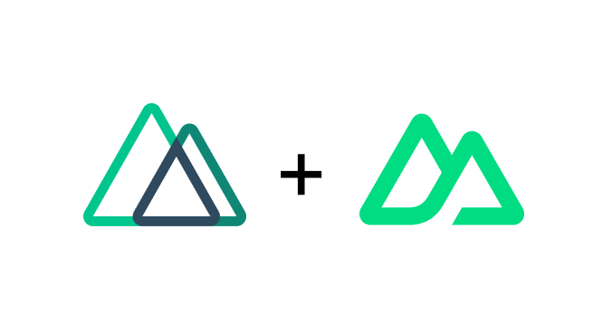

<a name="readme-top"></a>

<!-- PROJECT SHIELDS -->

[![Contributors][contributors-shield]][contributors-url]
[![Forks][forks-shield]][forks-url]
[![Stargazers][stars-shield]][stars-url]
[![Issues][issues-shield]][issues-url]
[![MIT License][license-shield]][license-url]

<!-- PROJECT LOGO -->
<br />
<div align="center">
  <a href="/">
    
  </a>

  <h3 align="center">Nuxt Content Template</h3>

  <p align="center">
    An opionionated Nuxt.js Template with Nuxt Content!
    <br />
    <a href="https://nuxt-content-template.netlify.app/"><strong>View Demo »</strong></a>
    <br />
    <br />
    <a href="https://github.com/data-miner00/nuxt-content-template">Explore the docs</a>
    ·
    <a href="https://github.com/data-miner00/nuxt-content-template/issues">Report Bug</a>
    ·
    <a href="https://github.com/data-miner00/nuxt-content-template/issues">Request Feature</a>
  </p>
</div>

<!-- TABLE OF CONTENTS -->
<details>
  <summary>Table of Contents</summary>
  <ol>
    <li>
      <a href="#about-the-project">About The Project</a>
      <ul>
        <li><a href="#built-with">Built With</a></li>
        <li><a href="#features">Features</a></li>
      </ul>
    </li>
    <li>
      <a href="#getting-started">Getting Started</a>
      <ul>
        <li><a href="#prerequisites">Prerequisites</a></li>
        <li><a href="#installation">Installation</a></li>
      </ul>
    </li>
    <li><a href="#usage">Usage</a></li>
    <li><a href="#roadmap">Roadmap</a></li>
    <li><a href="#contributing">Contributing</a></li>
    <li><a href="#license">License</a></li>
    <li><a href="#acknowledgments">Acknowledgments</a></li>
  </ol>
</details>

<!-- ABOUT THE PROJECT -->

## About The Project


An extremely opinionated template for building Markdown oriented Nuxt websites with Nuxt Content and TailwindCSS. Focus on the development itself rather than low-level configurations.

Incentives:

- Wanted to build out my new personal website
- Want Markdown
- Want newest version of Vue, Nuxt and Nuxt Content (at the time).
- Build this multi-purpose template so I can use for other projects.

Projects that use this template:

- [notes.mumk.dev](https://notes.mumk.dev)

<p align="right">(<a href="#readme-top">back to top</a>)</p>

### Built With

The technologies and tools used within this template.

- Vue
- Nuxt
- Nuxt Content
- TailwindCSS
- TypeScript

The version for Nuxt (3.6.1) and Nuxt Content (2.7.0) must remain. Updating the version for these two packages will break the static site generation. Regardless, the existing version in my humble opinion is good enough to create a functional documentation/blogs.

<p align="right">(<a href="#readme-top">back to top</a>)</p>

### Features

This template currently offers the following features. For more info, please read the [guide](https://nuxt-content-template.netlify.app/guide).

- Markdown articles
- Markdown embeddable LaTeX (`rehype-mathjax`, `remark-math`)
  - Math Equations
  - [Chemical Equations](https://notes.mumk.dev/articles/general/latex#chemical-equations)
- Internationalization (i18n, `@nuxtjs/i18n`)
- Dark Mode (`@nuxtjs/color-mode`)
- Mobile responsive
- Styling with TailwindCSS
- Static-site generation
- Simple SEO (`nuxt-seo-kit`)
  - Auto-generated Sitemap.xml
  - robots.txt
  - Optimized site metadata
- Image optimization (`@nuxt/image`)
- Vue utilities
  - Powerful hooks (`@vueuse/core`)
  - Animation (`@vueuse/motion`)
- 404 Page (the `/resource` url does not exist)
- Ultra-fast loading speed
- Support for Node 18 and Node 20
- Typo checking (need to install from [crates-ci/typos](https://github.com/crate-ci/typos))
- Sass support (although I don't remember using it 😁)

Again, if you wish to grok what this template is capable of, consider visiting [my technical blog](https://notes.mumk.dev) to see it for yourself.

<p align="right">(<a href="#readme-top">back to top</a>)</p>

<!-- GETTING STARTED -->

## Getting Started

### Prerequisites

The list of tools that is used when development.

- npm
  ```sh
  npm install npm@latest -g
  ```
- Pnpm
  ```sh
  npm i -g pnpm
  ```
- [Git](https://git-scm.com/downloads)

### Installation

To run this template project in your local for personal use or contribution, simply perform the following.

1. Clone the repo
   ```sh
   git clone https://github.com/data-miner00/nuxt-content-template.git
   ```
2. Install Node dependencies
   ```sh
   pnpm i
   ```
3. Start the development server
   ```sh
   pnpm dev
   ```

> ⚠️ Important: **Do not update** the dependencies as it will break due to incompatibilities from the latest Nuxt and Nuxt Content.

<p align="right">(<a href="#readme-top">back to top</a>)</p>

<!-- ROADMAP -->

## Roadmap

- [x] Add Dark Mode
- [x] Add i18n
- [x] Add Styling
  - [x] Sass
  - [x] Tailwind
- [ ] Add PWA Manifest
- [x] Responsive styles
- [ ] DocSearch
- [x] Copy code block button
- [ ] Add line numbers to code block
- [x] Add highlight to code block
- [ ] Add missing items to mobile navbar

See the [open issues](https://github.com/data-miner00/nuxt-content-template/issues) for a full list of proposed features (and known issues).

<p align="right">(<a href="#readme-top">back to top</a>)</p>

<!-- CONTRIBUTING -->

## Contributing

Contributions are what make the open source community such an amazing place to learn, inspire, and create. Any contributions you make are **greatly appreciated**.

If you have a suggestion that would make this better, please fork the repo and create a pull request. You can also simply open an issue with the tag "enhancement".
Don't forget to give the project a star! Thanks again!

1. Fork the Project
2. Create your Feature Branch (`git checkout -b feature/AmazingFeature`)
3. Commit your Changes (`git commit -m 'Add some AmazingFeature'`)
4. Push to the Branch (`git push origin feature/AmazingFeature`)
5. Open a Pull Request

<p align="right">(<a href="#readme-top">back to top</a>)</p>

<!-- LICENSE -->

## License

Distributed under the MIT License. See `LICENSE` for more information.

<p align="right">(<a href="#readme-top">back to top</a>)</p>

<!-- ACKNOWLEDGMENTS -->

## Acknowledgments

List of resources that are helpful and would like to give credit to.

- [Vue.js v3](https://vuejs.org/)
- [Nuxt v3](https://nuxt.com/)
- [Nuxt Content](https://content.nuxtjs.org)
- [Robots.txt](https://developers.google.com/search/docs/crawling-indexing/robots/intro)
- [enji.dev](https://www.enji.dev/)
- [How to Create a Custom Code Block With Nuxt Content v2](https://mokkapps.de/blog/how-to-create-a-custom-code-block-with-nuxt-content-v2/)
- [VueUse](https://vueuse.org/)
- [@nuxtjs/color-mode](https://color-mode.nuxtjs.org/)
- [Nuxt Tailwind](https://tailwindcss.nuxtjs.org/)
- [How to add class attribute to the body tag in NuxtJs](https://postsrc.com/code-snippets/how-to-add-class-attribute-to-the-body-tag-in-nuxtjs)
- [Nuxt i18n](https://v8.i18n.nuxtjs.org/)
- [How to Build a Multi-Language Application with NuxtJS](https://crowdin.com/blog/2023/01/24/nuxt-js-i18n-tutorial)
- [Vue i18n](https://vue-i18n.intlify.dev/)
- [Nuxt Seo Kit](https://github.com/harlan-zw/nuxt-seo-kit)
- [Nuxt Image](https://image.nuxtjs.org/)
- [Nuxt UI](https://ui.nuxt.com/)

<p align="right">(<a href="#readme-top">back to top</a>)</p>

<!-- MARKDOWN LINKS & IMAGES -->

[contributors-shield]: https://img.shields.io/github/contributors/data-miner00/nuxt-content-template.svg?style=for-the-badge
[contributors-url]: https://github.com/data-miner00/nuxt-content-template/graphs/contributors
[forks-shield]: https://img.shields.io/github/forks/data-miner00/nuxt-content-template.svg?style=for-the-badge
[forks-url]: https://github.com/data-miner00/nuxt-content-template/network/members
[stars-shield]: https://img.shields.io/github/stars/data-miner00/nuxt-content-template.svg?style=for-the-badge
[stars-url]: https://github.com/data-miner00/nuxt-content-template/stargazers
[issues-shield]: https://img.shields.io/github/issues/data-miner00/nuxt-content-template.svg?style=for-the-badge
[issues-url]: https://github.com/data-miner00/nuxt-content-template/issues
[license-shield]: https://img.shields.io/github/license/data-miner00/nuxt-content-template.svg?style=for-the-badge
[license-url]: https://github.com/data-miner00/nuxt-content-template/blob/master/LICENSE
